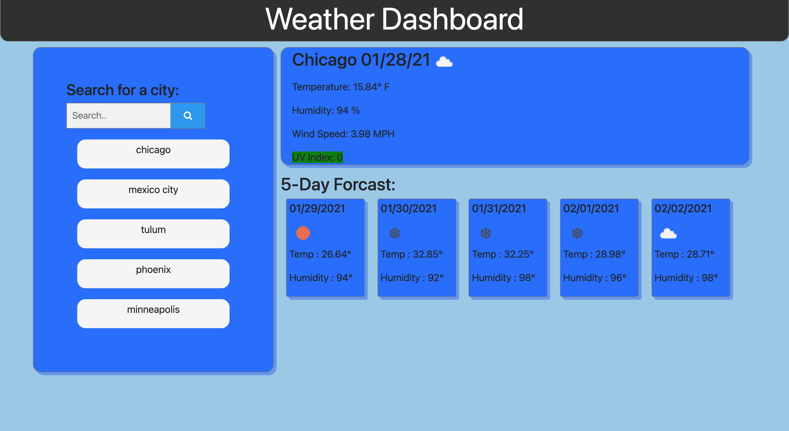

# Assignment 6 Server-Side APIs: Weather Dashboard

---
---


---
---
Developers are often tasked with retrieving data from another application's API and using it in the context of their own. Third-party APIs allow developers to access their data and functionality by making requests with specific parameters to a URL. Your challenge is to build a weather dashboard that will run in the browser and feature dynamically updated HTML and CSS.

I used the [OpenWeather API](https://openweathermap.org/api) to retrieve weather data for cities. The documentation includes a section called "How to start" that will provide basic setup and usage instructions.  I used `localStorage` to store any persistent data.

## User Story

```
AS A traveler
I WANT to see the weather outlook for multiple cities
SO THAT I can plan a trip accordingly
```

## Acceptance Criteria

```
GIVEN a weather dashboard with form inputs
WHEN I search for a city
THEN I am presented with current and future conditions for that city and that city is added to the search history
WHEN I view current weather conditions for that city
THEN I am presented with the city name, the date, an icon representation of weather conditions, the temperature, the humidity, the wind speed, and the UV index
WHEN I view the UV index
THEN I am presented with a color that indicates whether the conditions are favorable, moderate, or severe
WHEN I view future weather conditions for that city
THEN I am presented with a 5-day forecast that displays the date, an icon representation of weather conditions, the temperature, and the humidity
WHEN I click on a city in the search history
THEN I am again presented with current and future conditions for that city
WHEN I open the weather dashboard
THEN I am presented with the last searched city forecast
```
## Review

You are required to submit the following for review:

* The URL of the deployed application.

* The URL of the GitHub repository. Give the repository a unique name and include a README describing the project.

## Requirements Met

* weather dashboard is given with form inputs
* when you search for a city, then you are presented with current and future conditions for that city and that city is added to the search history
* when you view current weather conditions for that city then you are presented with the city name, the date, an icon representation of weather conditions, the temperature, the humidity, the wind speed, and the uv index
* when you view the uv index, then you are presented with a color that indicates whether the conditions are favorable, moderate, or severe
* when you view future weather conditions for that city, you are presented with a 5-day forecast that displays the date, an icon representation of weather conditions, the temperature, and the humidity
* when you click on a city in the search history then you are again presented with current and future conditions for that city
* when you open the weather dashboard then the last city searched is in the forecast area

## Technologies Used
---
1. HTML
2. CSS
3. Javascript
4. JQUERY
5. MomentJS
6. Local Storage
7. AJAX
8. Bootstrap

## In Action
---


## Issues

This by far was the most complete test of the overall skills I have learned in class up to this point.  The combination of having to create a page from the ground up, a few intricate styling details that were buggy, and the functionality of ajax and local storage, it was a true test.  I had issues at every level from beginning to end.  Initially I prepared the page visually and with local functionality.  I then introduced the ajax and started plugging the empty fields with the info from the calls.  In this department getting the correct call for the icons was challenging but was ultimately solved with a little help from google.  The weather API was quite well put together so once worked with for a day or two pulling data from certain parts of the object became a breeze.  A big issue I had was with small details with the functionality of the site.  I had a serious problem with making the dynamically created buttons stick and become clickable themselves.  With tons of help from the bcs ask team I was able to traverse these challenges and finally got them to function.  I also leaned on my instructor, Chris, to help me through with minor details like how to make those buttons function correctly after they are created.  I was able to use what he showed me to make it so an invalid city that was entered was not pushed to a button, and also initially alerts the user to an error with the ajax call.  Overall, I am pretty happy with the final product and might keep working on this to build on my skillsets with jquery, ajax, and using page events.


## Links
Here are links to both the repo, and the deployed page!
https://cmgson.github.io/Weather-Api/
https://github.com/cmgson/Weather-Api
